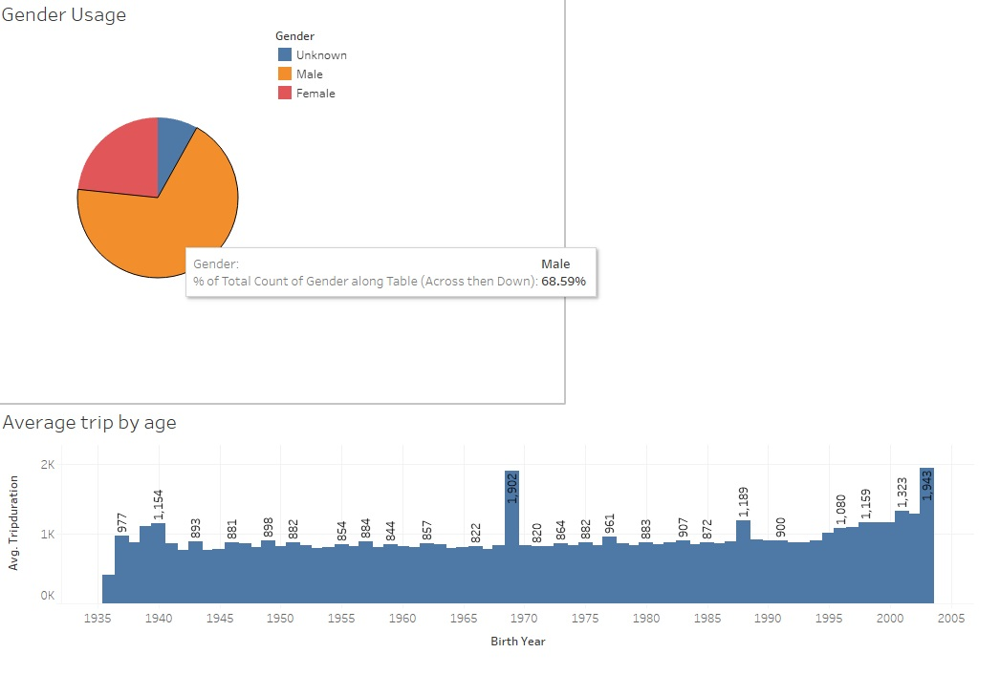
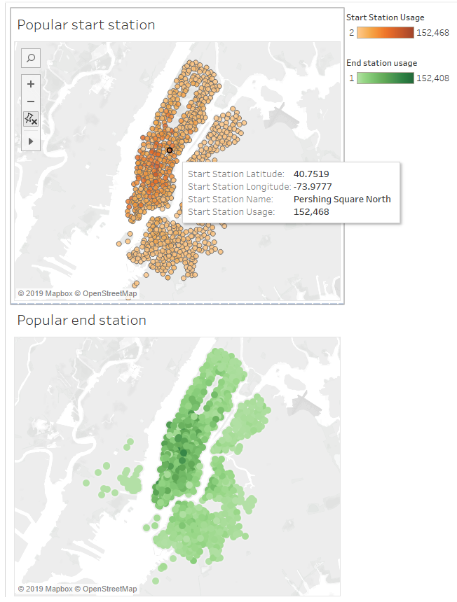
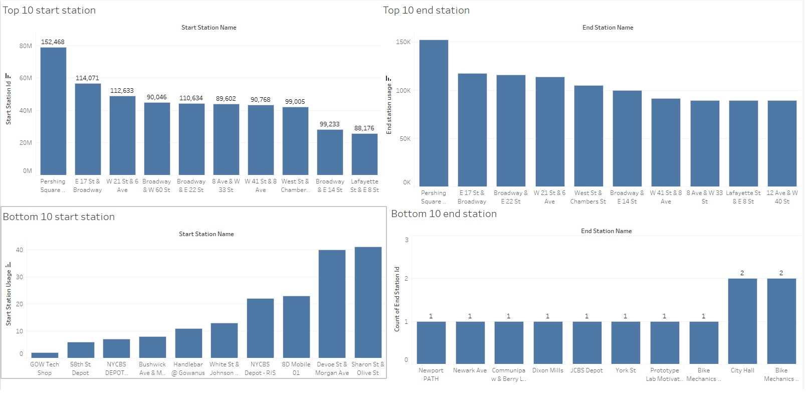

# Tableau Assignment - Citi Bike Analytics

## Background

Acting analyst [New York Citi Bike](https://en.wikipedia.org/wiki/Citi_Bike) Program, generate regular reports for city officials looking to publicize and improve the city program.

Each month bike data is collected, organized, and made public on the [Citi Bike Data](https://www.citibikenyc.com/system-data) webpage.

Build a set of data reports to provide the answers. 

Aggregate the data found in the Citi Bike Trip History Logs to build a data dashboard, story, or report.  One year time frame from April 2018 to April 2019.

Data for one year from the last available is first collect from resource link: https://s3.amazonaws.com/tripdata/index.html
files include:

201805-citibike-tripdata.csv.zip

201806-citibike-tripdata.csv.zip

201807-citibike-tripdata.csv.zip

201808-citibike-tripdata.csv.zip

201809-citibike-tripdata.csv.zip

201810-citibike-tripdata.csv.zip

201811-citibike-tripdata.csv.zip

201812-citibike-tripdata.csv.zip

201901-citibike-tripdata.csv.zip

201902-citibike-tripdata.csv.zip

201903-citibike-tripdata.csv.zip

201904-citibike-tripdata.csv.zip

Citi Bike Daily Ridership and Membership Data from April 2018 to March 2019
 

Final product assess on the following metrics: 

* Analytic Rigor

* Readability

* Visual Attraction
